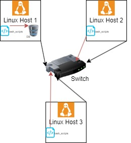

# Introduction

This project is an MVP designed to collect and store data about the system resource usage of different hosts in a cluster. It allows users to write SQL queries to analyze and answer business questions using this data. The project utilizes Linux command lines, Bash scripts, PostgreSQL, docker, and GitHub. A psql instance is used to persist all the data, and the bash agent gathers server usage data and inserts it into the psql instance. The agent consists of two Bash scripts that respectively collect hardware information and current host usage data and insert them into the database. The cron job schedules the host_usage.sh script to run every minute. The database is provisioned with Docker, and the source code is managed by GitHub. The project is primarily aimed at the LCA team but could be used by other teams or individuals who need to analyze the system resource usage of the cluster.

# Quick Start

### Start a psql instance using psql_docker.sh
```
./scripts/psql_docker.sh start
```
### Create tables using ddl.sql
```
psql -h localhost -U postgres -d host_agent -f sql/ddl.sql
```
### Insert hardware specs data into the DB using host_info.sh
```
./scripts/host_info.sh localhost 5432 host_agent postgres password
```
### Insert hardware usage data into the DB using host_usage.sh
```
./scripts/host_usage.sh localhost 5432 host_agent postgres password
```
### Crontab setup

#### Edit the crontab file
```
crontab -e
```
#### Add the following line to the crontab file to schedule host_usage.sh to run every minute:
```
 * * * * * bash /home/centos/dev/jarvis_data_eng-Anissbenddine/linux_sql/scripts/host_usage.sh localhost 5432 host_agent postgres password > /tmp/host_usage.log
```

# Implementation

To implement the project, we followed the requirements provided in the prompt. We designed and implemented an MVP that allows the LCA team to meet their business needs. Our MVP helps users to write SQL queries to answer business questions using the collected data. The project is built using Linux command lines, Bash scripts, PostgreSQL, Docker, and IDE.

We used the following approach to implement the project:

We designed a PostgreSQL database schema to store hardware information and usage data for all hosts.
We created Bash scripts to gather server usage data and insert it into the PostgreSQL instance. The agent consists of two Bash scripts:
host_info.sh collects host hardware info and inserts it into the database. It runs only once at the installation time.
host_usage.sh collects the current host usage (CPU and memory) and inserts it into the database. It is triggered by the cron job every minute.
We provisioned the database using Docker, and the source code is managed by Git.
We provided instructions on how to start the PostgreSQL instance using psql_docker.sh, create tables using ddl.sql, and insert hardware data using host_info.sh and host_usage.sh.
We set up crontab to schedule host_usage.sh to run every minute.
Overall, our implementation allows users to gather hardware information and usage data for all hosts and use SQL queries to answer business questions.


## Architecture
The cluster diagram with three Linux hosts, a DB, and agents is saved in the `assets` directory.



## Scripts
Shell script description and usage :

### psql_docker.sh

This script is used to launch a PostgreSQL instance in a Docker container. The script takes two arguments: the first argument is the username to be used for the database, and the second argument is the password to be used for the database. Here is an example usage of the script:
```
./scripts/psql_docker.sh username password
```


### host_info.sh

This script collects the hardware information of the host machine and inserts it into the PostgreSQL database. The script should be run once during installation time. Here is an example usage of the script:
```
./scripts/host_info.sh psql_host psql_port db_name psql_user psql_password
```

### host_usage.sh

This script collects the current CPU and memory usage of the host machine and inserts it into the PostgreSQL database. The script is scheduled to run every minute using crontab. Here is an example usage of the script:

```
./scripts/host_usage.sh psql_host psql_port db_name psql_user psql_password
```

### crontab

crontab is used to schedule the host_usage.sh script to run every minute. Here is an example crontab entry:

```
* * * * * bash /path/to/host_usage.sh psql_host psql_port db_name psql_user psql_password > /tmp/host_usage.log
```

## Database Modeling
Schema of each table
`host_info`
| Column Name   | Data Type  | Description                                           |
|---------------|------------|-------------------------------------------------------|
| id            | serial     | Unique identifier of the host machine                 |
| hostname      | varchar(50)| Name of the host machine                              |
| cpu_number    | integer    | Number of CPUs on the host machine                     |
| cpu_architecture| varchar(50)| Architecture of the CPU on the host machine           |
| cpu_model     | varchar(50)| Model name of the CPU on the host machine               |
| cpu_mhz       | float      | Clock speed of the CPU in MHz on the host machine      |
| l2_cache      | varchar(50)| Size of level 2 cache memory in KB on the host machine  |
| total_mem     | integer    | Total memory on the host machine in KB                 |
| timestamp     | timestamp  | Time when the record is inserted into the table       |

`host_usage`
| Column Name   | Data Type  | Description                                             |
|---------------|------------|---------------------------------------------------------|
| timestamp     | timestamp  | Time when the record is inserted into the table         |
| host_id       | integer    | Foreign key referencing the host_info table             |
| memory_free   | integer    | Amount of free memory available on the host machine in KB|
| cpu_idle      | float      | Percentage of idle CPU on the host machine               |
| cpu_kernel    | float      | Percentage of CPU kernel usage on the host machine       |
| disk_io       | integer    | Number of disk I/O operations per second on the host machine|
| disk_available| integer    | Amount of available disk space on the host machine in KB |


# Test
To test the DDL.sql script, I used the psql command-line tool to execute the SQL statements and create the host_info and host_usage tables. Here are the steps that I followed:

Started a PostgreSQL container using the psql_docker.sh script.
Connected to the PostgreSQL instance using the psql command-line tool.
Executed the DDL.sql script to create the host_info and host_usage tables.
After executing the DDL.sql script, I checked the schema of the host_info and host_usage tables using the following SQL commands:

```
\d host_info
\d host_usage
```

The result of these commands showed that the tables were successfully created with the expected column names and data types.

I also tested the scripts by inserting sample data into the tables and verifying that the data was correctly inserted using SQL SELECT statements.

```
SELECT * FROM host_usage;
```
# Deployment

The application was deployed using several tools and technologies. Here is a brief overview of the deployment process:

The source code for the application was stored on a GitHub repository. The team used Git to collaborate on the code and make changes to it.
A PostgreSQL instance was provisioned using Docker. The psql_docker.sh script was used to start the PostgreSQL container.
The DDL.sql script was executed to create the host_info and host_usage tables in the PostgreSQL database.
The host_info.sh and host_usage.sh scripts were deployed to each Linux host. The scripts were used to collect and insert system usage data into the host_usage table.
A cron job was set up on each Linux host to run the host_usage.sh script every minute and insert the collected data into the host_usage table.
Users were able to query the data in the host_usage table using SQL queries in the queries.sql file.
Overall, the deployment process involved a combination of technologies such as Git, Docker, Bash scripts, and cron jobs to create a scalable and reliable application for monitoring cluster usage data.


# Improvements

- Security: The current implementation of the application doesn't include any security mechanisms to protect against unauthorized access to the database or the cluster nodes. Implementing security measures such as authentication and encryption would be an important step in securing the application and ensuring the confidentiality and integrity of the data it collects.

- Alerting and monitoring: The application currently collects usage data, but doesn't include any alerting or monitoring capabilities to notify users of potential issues or resource constraints. Implementing alerting and monitoring features that can alert users when certain thresholds are exceeded, or when nodes are experiencing performance issues, would be a valuable addition to the application.

- Data retention and management: Currently, the application inserts usage data into the host_usage table every minute. However, this can lead to a large amount of data accumulation over time, which could make it difficult to query and analyze the data. To address this, we could implement a data retention policy to periodically delete or archive old data to keep the database size manageable.
